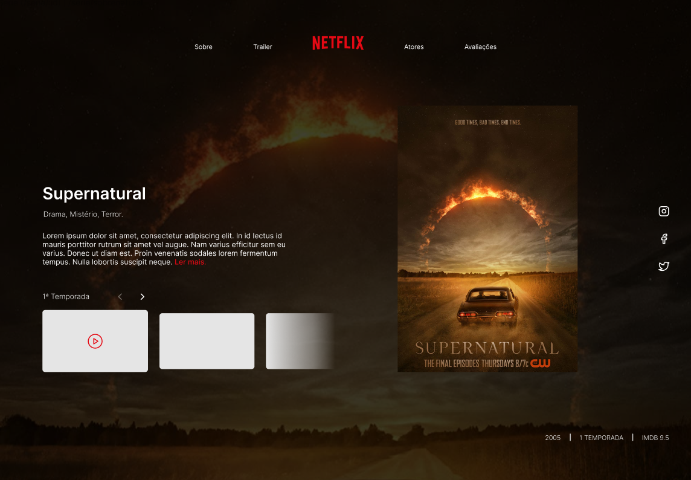

# Clone Netflix

Clone pagína Netflix, baseada no layout disponibilizado pelo professor.

### Exercício curso Futuro DEV, semana 04, módulo 2

## Tecnologia ultilizadas

HTML,manipulação do DOM,CSS e eventos.

## Como rodar o projeto

#### Clone este repositório em sua máquina local:

git clone 

Abra o arquivo no VSCode e para visulaizar clique no arquivo index.html com botão direito para abrir a url

## Desenvolvedora

- Fernanda Linhares (https://www.linkedin.com/in/fernanda-linhares-b10ba32b/)

